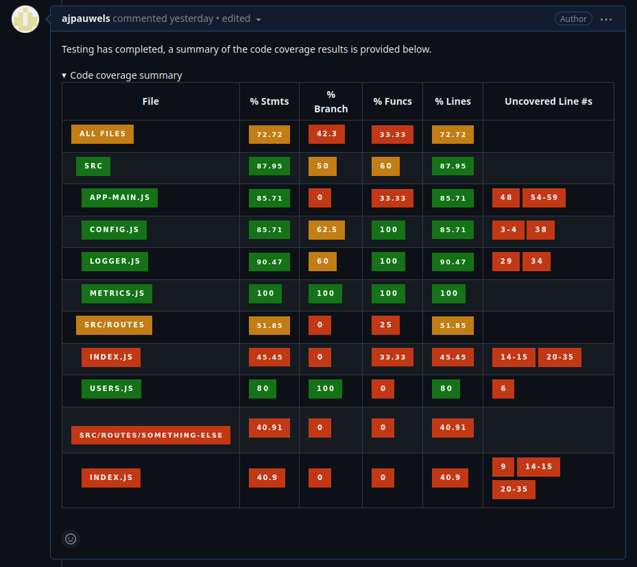

# gitops-coverage
A tool that takes json-summary and lcov coverage reports and condenses
them into a Markdown comment that can be posted on a GitHub PR

# Example

# Configuration

All configuration is provided as environment variables.

NOTE: Relative file paths should be relative to where the script was
called from, NOT relative to where the script file is.

## `GITOPS_COVERAGE_JSON_SUMMARY_FILE_PATH`

Provides an **absolute or relative** path to the location of the
`coverage-summary.json` file generated by the
[json-summary](https://istanbul.js.org/docs/advanced/alternative-reporters/#json-summary
"json-summary reporter") IstanbulJS reporter.

Example: `/home/username/myproject/coverage/coverage-summary.json`

## `GITOPS_COVERAGE_LCOV_INFO_FILE_PATH`

Provides an **absolute or relative** path to the location of the
`lcov.info` file generated by the
[lcovonly](https://istanbul.js.org/docs/advanced/alternative-reporters/#lcovonly
"lcovonly reporter") IstanbulJS reporter.

Example: `/home/username/myproject/coverage/lcov.info`

## `GITOPS_COVERAGE_PROJECT_PATH`

Provides an **absolute** path to the location of the project from
where the coverage files were generated. This is very important as the
json-summary reporter reports absolute paths to all tested files, and
this setting allows for eliminating this long absolute prefix and only
providing file/directory names relative to the project directory in
the final output.

Example: `/home/username/myproject`

## `GITOPS_COVERAGE_OUTPUT_FILE`

Provides an **absolute or relative** path to the file where the final
Markdown comment should be written, rather than writing it out to
console.

Example: `/home/username/myproject/gitops-coverage-comment.md`
